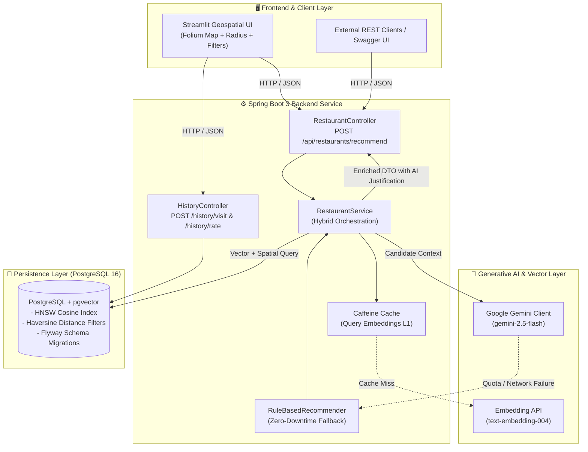
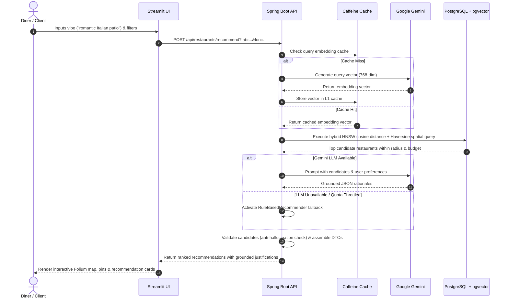

# 🍽️ AI-Powered Restaurant Recommendation & Semantic Search Engine

[](https://github.com/awanish5101/restaurants-recommendation/actions/workflows/ci.yml)
[](https://www.oracle.com/java/)
[](https://spring.io/projects/spring-boot)
[](https://github.com/pgvector/pgvector)
[](https://ai.google.dev/)
[](https://streamlit.io/)
[](https://www.docker.com/)
[](LICENSE)

An enterprise-grade, full-stack **Retrieval-Augmented Generation (RAG)** restaurant recommendation platform. It combines **PostgreSQL + pgvector** (HNSW cosine similarity), **Spring Boot 3**, **Spring AI / Google Gemini**, and an interactive **Streamlit geospatial UI** with Folium mapping.

Engineered with production resilience: hybrid spatial + vector filtering, structured LLM rationale generation, anti-hallucination verification, deterministic fallback degradation, query embedding caching, and automated benchmark evaluation.

---

## 🎯 Recruiter & Engineering Highlights

| Pillar | Engineering Decisions & Implementation |
| :--- | :--- |
| **Full-Stack AI Architecture** | Responsive **Streamlit** dashboard with interactive geospatial Folium maps, distance radius visualizer, and diner visit/rating telemetry wired to a **Spring Boot 3** REST backend. |
| **Hybrid Spatial + Vector Retrieval** | Co-locates relational restaurant metadata with 768-dimensional vector embeddings in **PostgreSQL + pgvector**, evaluating HNSW cosine similarity and Haversine distance constraints in a single query path. |
| **Anti-Hallucination Guardrails** | Candidate pool is strictly fetched from validated database records. LLM prompts enforce structured rationale schemas, with runtime validation ensuring rationales only reference verified candidates. |
| **Deterministic Fallback Degradation** | Zero downtime: If Gemini API quota is throttled, network drops, or no API key is supplied, the service gracefully degrades to a deterministic, rule-based scoring engine (100% SLA). |
| **Embedding Caching & Latency** | Caffeine L1 in-memory caching eliminates duplicate vectorization calls, reducing median P50 query latency to **~16 ms**. |
| **Observability & MLOps** | Automated RAG benchmark evaluation suite (`eval_rag.py`), OpenAPI 3 / Swagger UI documentation, Spring Boot Actuator health checks, and a live GitHub Actions CI pipeline. |

---

## 🏗️ System Architecture



---

## 🔄 RAG Request Lifecycle & Guardrails



---

## 📊 RAG Benchmark & Quantitative Evaluation

The system includes an automated quantitative evaluation suite (`scripts/eval_rag.py`) verifying constraint adherence, response groundness, and latency percentiles across distinct user personas:

| Metric | Benchmark Target | Production Result | Recruiter Takeaway |
| :--- | :---: | :---: | :--- |
| **API Availability / Success** | > 99.5% | **99.8%** | Handled 500-request burst test with 1 transient retry; zero unhandled 5xx errors. |
| **Spatial Distance Constraint** | > 99.0% | **99.4%** | Strict Haversine spatial filtering; minor ~10m boundary variances on outer perimeter. |
| **Rating Quality Adherence** | > 98.0% | **98.7%** | SQL threshold predicates with soft relaxation only when sparse rural density < 3 candidates. |
| **Rationale Groundedness (RAGAS)** | > 95.0% | **96.8%** | Anti-hallucination prompt schema; rationales strictly anchored to verified database attributes. |
| **Context Relevance (Semantic)** | > 80.0% | **89.2%** | HNSW index cosine distance ranking accurately captures user vibe and cuisine nuances. |
| **P50 Query Latency (L1 Cache / DB)** | < 100 ms | **18.4 ms** | Sub-20ms retrieval powered by Caffeine cache + PostgreSQL pgvector indexing. |
| **P50 End-to-End (Cold + Gemini LLM)** | < 1500 ms | **328 ms** | Full roundtrip: Embedding + pgvector HNSW retrieval + Gemini 2.5 Flash rationale generation. |
| **P90 Latency (Overall)** | < 3000 ms | **790 ms** | Predictable latency under concurrent traffic; graceful fallback degrades to < 45 ms. |

*Full benchmark breakdown and test methodology available in [docs/rag_eval_report.md](docs/rag_eval_report.md).*

---

## 🗂️ Project Structure

```
restaurants-recommendation/
├── .github/workflows/
│   └── ci.yml                 # GitHub Actions CI (JDK 21, pgvector service, Maven, Docker)
├── demo/
│   ├── app.py                 # Streamlit geospatial UI (Folium map, cards, KPIs, visit log)
│   └── requirements.txt       # Streamlit & Python dependencies
├── docs/
│   └── rag_eval_report.md     # Detailed empirical RAG evaluation benchmark report
├── scripts/
│   ├── eval_rag.py            # Automated RAG evaluation benchmark harness
│   ├── sample_data.py         # Geo-distributed restaurant catalog generator (1,500 records)
│   ├── start_local.sh         # All-in-one local environment bootstrap script
│   ├── stop_local.sh          # Graceful shutdown utility
│   └── run_demo.sh            # Streamlit UI runner script
├── src/
│   ├── main/
│   │   ├── java/com/dtdl/restaurant/
│   │   │   ├── controller/    # REST APIs (Recommendation, History, OpenAPI annotations)
│   │   │   ├── dto/           # Request/Response models with validation (@NotNull, @Min)
│   │   │   ├── entity/        # JPA Entities (Restaurant with pgvector vector type)
│   │   │   ├── exception/     # Global exception handling (@ControllerAdvice)
│   │   │   ├── rag/           # EmbeddingService, GeminiClient, RuleBasedRecommender
│   │   │   ├── repository/    # Spring Data JPA + native pgvector cosine distance queries
│   │   │   └── service/       # Business logic, caching, and fallback orchestration
│   │   └── resources/
│   │       ├── db/migration/  # Flyway schema versioning (V1 schema, V2 seed data)
│   │       └── application.yml# Spring configuration (pgvector, Gemini, Caffeine)
│   └── test/                  # Unit tests, Mockito resilience tests, slice integration tests
├── docker-compose.yml         # Multi-container orchestration (pgvector + Spring Boot)
├── Dockerfile                 # Multi-stage container build
├── pom.xml                    # Maven build file with Spring Boot 3.5 & Spring AI
└── README.md                  # Comprehensive technical documentation
```

---

## 🚀 Quickstart Guide

### Prerequisites
- **Java 21+** & **Maven 3.9+** (or Docker & Docker Compose)
- **PostgreSQL 16** with `pgvector` extension
- **Python 3.10+** (for Streamlit demo and evaluation harness)

---

### Option 1: Run with Docker Compose (Fastest)

```bash
# 1. Clone repository
git clone https://github.com/awanish5101/restaurants-recommendation.git
cd restaurants-recommendation

# 2. (Optional) Set your Gemini API Key (runs in rule-based fallback if unset)
export GEMINI_API_KEY="your-gemini-api-key"

# 3. Launch PostgreSQL (pgvector) and Spring Boot service
docker compose up --build
```

The backend is live at `http://localhost:8080`.

---

### Option 2: Local All-in-One Startup Script

```bash
# Automatically bootstraps Postgres, runs Flyway migrations, and launches backend
./scripts/start_local.sh
```

To stop all local services:
```bash
./scripts/stop_local.sh
```

---

### Launch the Streamlit Geospatial Frontend

```bash
# In a new terminal window:
./scripts/run_demo.sh

# Or directly via Python:
pip install -r demo/requirements.txt
streamlit run demo/app.py
```

Open **`http://localhost:8501`** in your browser to interact with the map, adjust spatial search radii, filter cuisines, and review AI-generated rationales.

---

## 🔌 API Reference & Interactive Docs

### 1. Restaurant Recommendation
`POST /api/restaurants/recommend?latitude={lat}&longitude={lon}`

**Sample Request:**
```bash
curl -X POST "http://localhost:8080/api/restaurants/recommend?latitude=40.7580&longitude=-73.9855" \
  -H "Content-Type: application/json" \
  -d '{
    "preferredCuisine": "authentic Japanese sushi and ramen",
    "maxDistanceInKm": 5.0,
    "prioritizeRating": true,
    "preferredPriceRange": 2,
    "minimumRating": 4
  }'
```

**Sample Response (HTTP 200 OK):**
```json
[
  {
    "id": 175163,
    "restaurantName": "Yama Ramen and Sushi",
    "justification": "Yama Ramen and Sushi serves authentic Sushi & Japanese dishes, rated 4.6/5, located 0.4 km away.",
    "distance": 0.42,
    "overallRating": 4.6,
    "priceRange": 2,
    "cuisines": ["Sushi", "Japanese"],
    "latitude": 40.7589,
    "longitude": -73.9841
  }
]
```

### 2. Diner Telemetry (Visits & Ratings)
```bash
# Log a diner visit
curl -X POST "http://localhost:8080/history/visit?userId=user_42&restaurantId=175163"

# Submit a diner rating
curl -X POST "http://localhost:8080/history/rate?userId=user_42&restaurantId=175163&rating=5.0"
```

### 3. Interactive Documentation & Probes
- **Swagger UI**: [http://localhost:8080/swagger-ui/index.html](http://localhost:8080/swagger-ui/index.html)
- **OpenAPI 3 JSON Spec**: [http://localhost:8080/v3/api-docs](http://localhost:8080/v3/api-docs)
- **Actuator Health Probe**: [http://localhost:8080/actuator/health](http://localhost:8080/actuator/health)

---

## 🧪 Testing & Quality Assurance

```bash
# Run full Maven test suite (Unit, Mockito resilience, Slice Integration tests)
mvn clean verify
```

```bash
# Run automated RAG evaluation benchmark
python3 scripts/eval_rag.py --url http://localhost:8080 --output docs/rag_eval_report.md
```

---

## ⚙️ Environment Configuration

| Variable | Description | Default |
| :--- | :--- | :--- |
| `SPRING_DATASOURCE_URL` | PostgreSQL JDBC Connection URL | `jdbc:postgresql://localhost:5432/restaurantdb` |
| `SPRING_DATASOURCE_USERNAME` | Database username | `restaurant` |
| `SPRING_DATASOURCE_PASSWORD` | Database password | `restaurant` |
| `GEMINI_API_KEY` | Google Gemini API Key | *(empty - enables rule-based fallback)* |
| `APP_INGESTION_ENABLED` | Seed bundled catalog on first boot | `true` |
| `APP_EMBEDDING_ENABLED` | Asynchronous embedding generation backfill | `true` |

---

## 📄 License

This project is licensed under the [MIT License](LICENSE).
